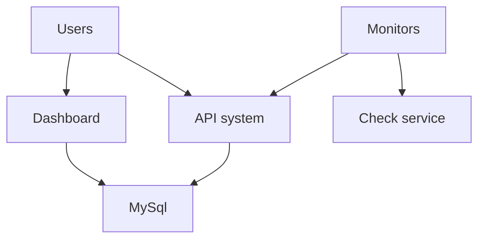
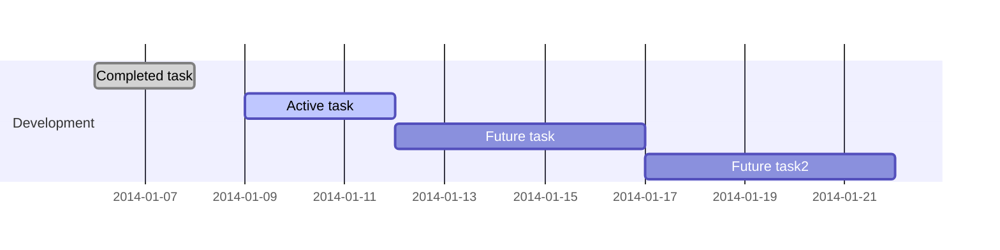

## Welcome to Uptime Frog!
Uptime Frog is **remote uptime checker/monitoring application** based on **Laravel Framework**.

## Installing

#### 1. Server requirements
You need to make sure your server meets the following requirements. For more informations visit **[Laravel Framework](https://laravel.com/docs/5.7/installation)** website.

-   PHP >= 7.1.3
-   OpenSSL PHP Extension
-   PDO PHP Extension
-   Mbstring PHP Extension
-   Tokenizer PHP Extension
-   XML PHP Extension
-   Ctype PHP Extension
-   JSON PHP Extension
-   BCMath PHP Extension

#### 2. Virtual hosts

#### 3. Clone project

#### 4. Composer inst
